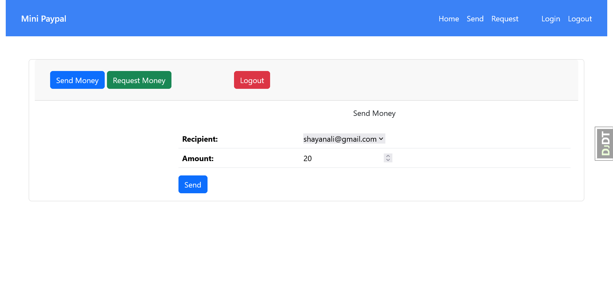
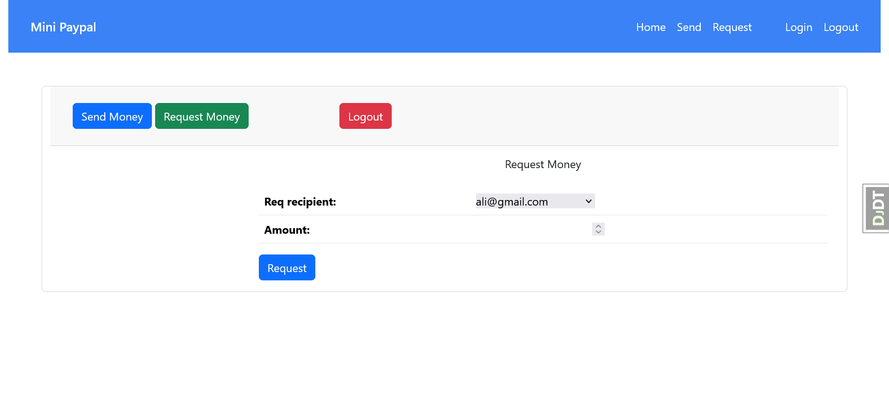

# Mini Paypal - An Online Multi User Payment System

## Tools

- Djano
- Django ORM
- SQLite database
- Django Rest API framework
- Requests module

## Design






## Enabling Https

Add or uncomment following lines of code into settings file to enable https

```python
SECURE_PROXY_SSL_HEADER = ('HTTP_X_FORWARDED_PROTO', 'https')
SECURE_SSL_REDIRECT = True
SESSION_COOKIE_SECURE = True
CSRF_COOKIE_SECURE = True
SECURE_HSTS_SECONDS = 31536000  # 1 year
SECURE_HSTS_INCLUDE_SUBDOMAINS = True
SECURE_HSTS_PRELOAD = True


# SECURITY WARNING: don't run with debug turned on in production!
DEBUG = False
```

Set allowed hosts as well 

```python
ALLOWED_HOSTS = [
    # allowed host
]
```